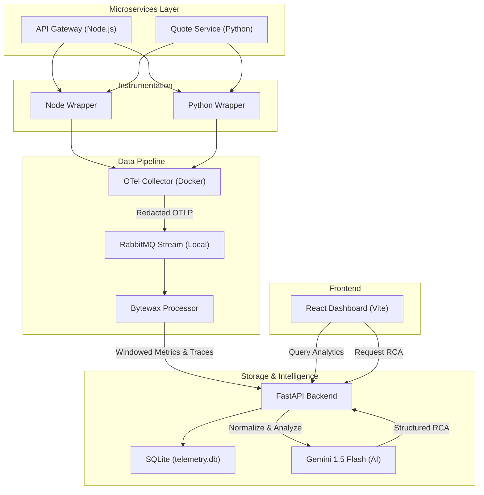
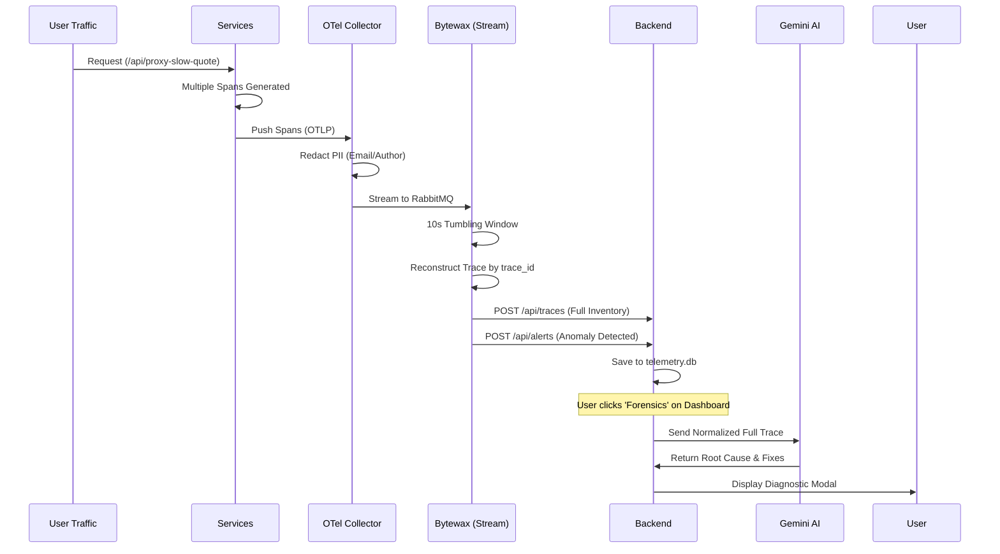

# MonoXAI: High-Precision Forensics & Telemetry Platform

MonoXAI is a premium observability stack designed for multi-service environments. It features automated instrumentation, high-throughput stream processing with Bytewax, and an AI-powered diagnostic engine fueled by Gemini.

## 🏗️ System Architecture



## 🔍 Forensic Activity Flow

This diagram illustrates how Phase 5 reconstructs cross-service traces for AI analysis.



## 🚀 Getting Started

### Prerequisites
- Docker & Docker Compose
- RabbitMQ installed locally (v3.9+)
- Python 3.10+ & Node.js 18+
- Gemini API Key

### Running the Stack

1. **Environment Setup**
   Ensure your `.env` in `dashboard/backend/` has:
   ```env
   GEMINI_API_KEY=your_key_here
   ```

2. **Run the Master Script**
   Execute the unified startup script from the root directory:
   ```bash
   chmod +x start.sh
   ./start.sh
   ```

3. **Explore the Dashboard**
   Open your browser at: `http://localhost:5173`

## ☁️ Free Deployment (Hugging Face Spaces)

The dashboard backend ships with a built-in telemetry simulator, so the full
real-time experience (live metrics, anomaly alerts, trace forensics, AI RCA)
runs in a single free Docker container — no RabbitMQ/Bytewax/Collector needed.

1. Create a **write** token at https://huggingface.co/settings/tokens
2. Run:
   ```bash
   py deploy/deploy_hf.py --token hf_xxxxxxxx
   ```
   The script builds the React dashboard, assembles the Space files, creates
   the Space (`<your-username>/monoxai`), sets `GEMINI_API_KEY` from
   `dashboard/backend/.env` as a private Space secret, and uploads everything.
3. Wait ~2–4 min for the Space to build, then open
   `https://huggingface.co/spaces/<your-username>/monoxai`

Re-run the same command any time to redeploy after changes.

## ✨ Key Features (Phase 5)
- **AI RCA**: Instant root cause analysis with suggested fixes.
- **Trace Waterfall**: Multi-service visualization reconstructed in flight.
- **Sparkline Wave**: Real-time throughput and latency trends.
- **Resource Saturation**: Live CPU and Memory tracking.
- **Sidebar Controls**: Production-grade toggles for Live Mode and Auto-Correlation.

## 💳 Phase 6 — Universal Transaction Monitoring
- **Live transaction feed**: every transaction type (purchase, refund, payout, subscription, transfer, top-up) across UPI, credit/debit cards, net banking, wallets, bank transfers (NEFT/IMPS/RTGS), and BNPL, streamed in real time.
- **Payment KPIs**: success rate, INR volume (compact ₹ L/Cr), live TPS, failure counts — with sparklines.
- **Gateway health**: per-gateway failure rates (Razorpay, Stripe, PayU, CCAvenue, Cashfree, JusPay) and top failure reasons.
- **Payment incidents**: failure-rate storms, gateway timeouts, fraud velocity, duplicate charges — each with AI root-cause analysis.

## 💰 Real Payment Monitoring (webhooks)
The transaction feed can ingest **real gateway events** instead of (or alongside) simulated ones:

1. **Razorpay**: in the Razorpay dashboard → Settings → Webhooks, add
   `https://<your-app-url>/api/webhooks/razorpay` with events `payment.captured`,
   `payment.failed`, `refund.processed`, and a webhook secret. Set the same value
   as the `RAZORPAY_WEBHOOK_SECRET` secret on your deployment.
2. **Stripe**: add `https://<your-app-url>/api/webhooks/stripe` in Stripe →
   Developers → Webhooks (events `payment_intent.succeeded`,
   `payment_intent.payment_failed`, `charge.refunded`) and set
   `STRIPE_WEBHOOK_SECRET` to the signing secret (`whsec_...`).
3. **Anything else**: `POST /api/ingest/transaction` with header
   `X-API-Key: <INGEST_API_KEY>` and a JSON body (`amount`, `method`, `status`, ...).

All webhooks are HMAC signature-verified. Works with gateway **test mode**
(free, no KYC) and live mode alike.

### Automatic real-only mode
By default (`AUTO_REAL_ONLY=on`) the dashboard **stops simulating transactions
the moment the first real payment arrives** — the header badge flips from
`Demo Data` → `Awaiting Live` (once a gateway secret is set) → `Real Payments`,
and from then on the feed shows only genuine payments. Each row is tagged
`source: "sim" | "live"`. Check current mode any time at `GET /api/config`.

### Link Razorpay in 4 steps (test mode, free)
1. Create a free account at razorpay.com and stay in **Test Mode**.
2. On your deployment, set two secrets: `RAZORPAY_WEBHOOK_SECRET` (any strong
   string you choose) and `INGEST_API_KEY` (optional, for custom pushes).
3. In Razorpay → **Settings → Webhooks → Add New Webhook**:
   - URL: `https://<your-space>.hf.space/api/webhooks/razorpay`
   - Secret: the exact value of `RAZORPAY_WEBHOOK_SECRET`
   - Active events: `payment.captured`, `payment.failed`, `refund.processed`
4. Create a **Payment Link** in Razorpay and pay it with a test card/UPI — it
   appears in your live feed within seconds and the app switches to real-only.

Going live for real money: complete Razorpay KYC, switch the dashboard + webhook
to Live Mode. Razorpay (the licensed entity) moves the money on its own secure
page — this app only *monitors* the events, so no PCI burden falls on you.

## ☸️ Phase 6 — Kubernetes Monitoring
- **Live cluster view**: 3 nodes, ~18 pods across 6 deployments with real-time CPU/memory, restarts, and pod phases (Running / Pending / CrashLoopBackOff / OOMKilled).
- **Event stream**: scheduling, scaling (HPA), back-off, and OOM events.
- **K8s anomalies**: CrashLoopBackOff and OOMKilled alerts land in the incident stream with pod/node context and kubectl-level RCA suggestions.
- **Real manifests**: `k8s/` contains production-style Deployment/Service/HPA manifests to run the dashboard on an actual cluster (see [k8s/README.md](k8s/README.md)).
